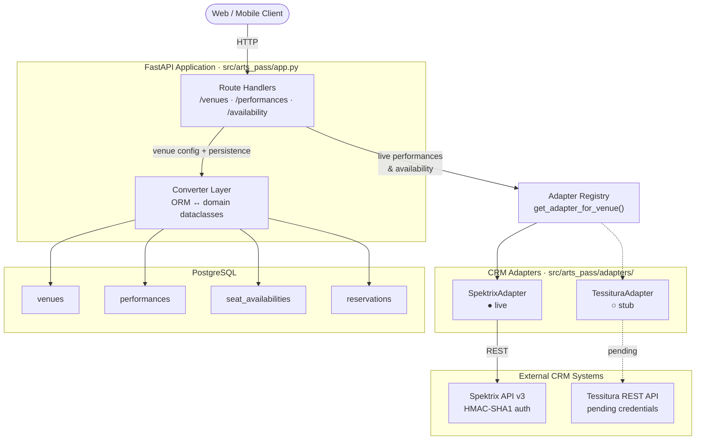

# System Architecture

This document gives technical readers a concise map of the ArtsPass backend: how the API layer, persistence layer, and CRM adapter system fit together. It is written for engineers who want to understand the system at a glance before diving into specific subsystems.

This document describes the system as designed. For what is currently live, stubbed, or in progress, see the [Current status](../README.md#current-status) section of the README.

## Overview diagram

## Components

### API layer

The ArtsPass backend is a [FastAPI](https://fastapi.tiangolo.com/) application that exposes four REST endpoints: listing venues, fetching a single venue by slug, listing performances for a venue, and fetching live seat availability for a performance. All routes use FastAPI's dependency injection (`Depends(get_db)`) to receive a SQLAlchemy session. Venue listing and detail routes read exclusively from the database; performance and availability routes first fetch venue configuration from the database to determine the CRM system, then delegate to the adapter registry for live data.

### Adapter registry

The adapter registry (`src/arts_pass/adapters/registry.py`) is a thin routing layer that maps a venue's `crm_system` string (e.g., `"spektrix"`, `"tessitura"`) to a concrete adapter instance via `get_adapter_for_venue(venue)`. Adapters are stateless singletons instantiated once at module load time. Adding support for a new CRM means implementing the `VenueCRMAdapter` abstract base class and registering the new adapter — no changes required to the API layer or database schema.

### CRM adapters

Each adapter translates between the ArtsPass domain model and a specific CRM's API. `SpektrixAdapter` is live: it handles HMAC-SHA1 request signing, maps Spektrix events and instances to `Performance` and `SeatAvailability` domain objects, and converts Spektrix price bands to typed `PriceTier` records. `TessituraAdapter` is currently a stub that raises `NotImplementedError` — the interface is in place; integration work begins once venue API credentials are confirmed.

### Persistence layer

We use SQLAlchemy 2.0 with a PostgreSQL backend and four tables: `venues` (venue configuration and CRM identity), `performances` (event catalog with timezone-aware datetimes), `seat_availabilities` (point-in-time availability snapshots), and `reservations` (patron bookings with status lifecycle). Database schema is managed entirely through Alembic migrations; the seed migration populates venue records and ensures a reproducible local development environment.

## Key design decisions

**Adapter pattern with a registry dispatch.** Each CRM has a fundamentally different data model — Spektrix organizes around events and instances; Tessitura around productions and performances. Rather than encoding CRM-specific branching in the API layer, we defined a `VenueCRMAdapter` abstract base class and route all CRM interactions through the registry. The API layer never imports an adapter directly; it calls `get_adapter_for_venue()` and works exclusively with domain types.

**Domain models decoupled from the ORM.** The `Venue`, `Performance`, `SeatAvailability`, and `Reservation` dataclasses in `src/arts_pass/models/` carry no SQLAlchemy instrumentation. Adapters produce and consume these types; the converter layer (`db/converters.py`) is the only place ORM rows and domain objects meet. This keeps adapter logic straightforward to unit-test without a database and ensures that CRM schema variations stay contained within the adapter layer.

**JSONB for price tiers and seat references.** Pricing tiers and seat references are variable-length, CRM-defined structures that differ across venues. We store them as JSONB columns (`seat_availabilities.price_tiers`, `reservations.seats`) rather than normalizing into separate tables. This avoids a fragile entity-attribute-value schema while keeping the data queryable via PostgreSQL's native JSONB operators.

**Alembic migrations from the first commit.** We introduced Alembic before writing the first ORM model. Every schema change — including initial table creation and venue seed data — lives in a versioned migration file. This gives us a reproducible development environment (`alembic upgrade head`), a clear audit trail, and a foundation for zero-downtime deploys as the schema evolves.

## Further reading

- [`docs/crm-adapter-pattern.md`](crm-adapter-pattern.md) — detailed walkthrough of the `VenueCRMAdapter` interface, the registry implementation, and how to add a new CRM integration
- [`docs/spektrix-integration.md`](spektrix-integration.md) — Spektrix API v3 specifics: HMAC-SHA1 request signing, event-to-performance mapping, and the instance aggregation model for seat availability
